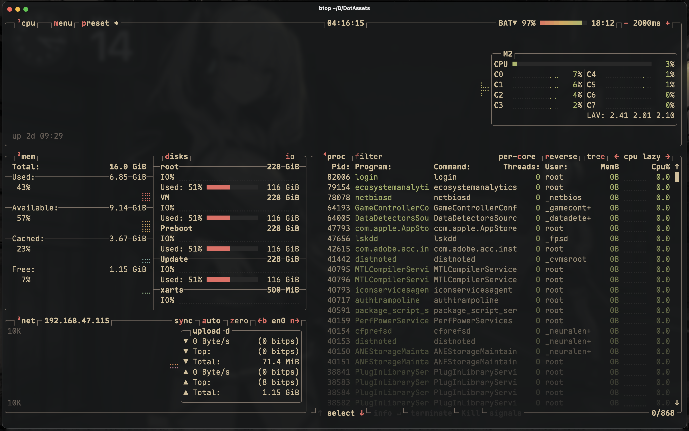
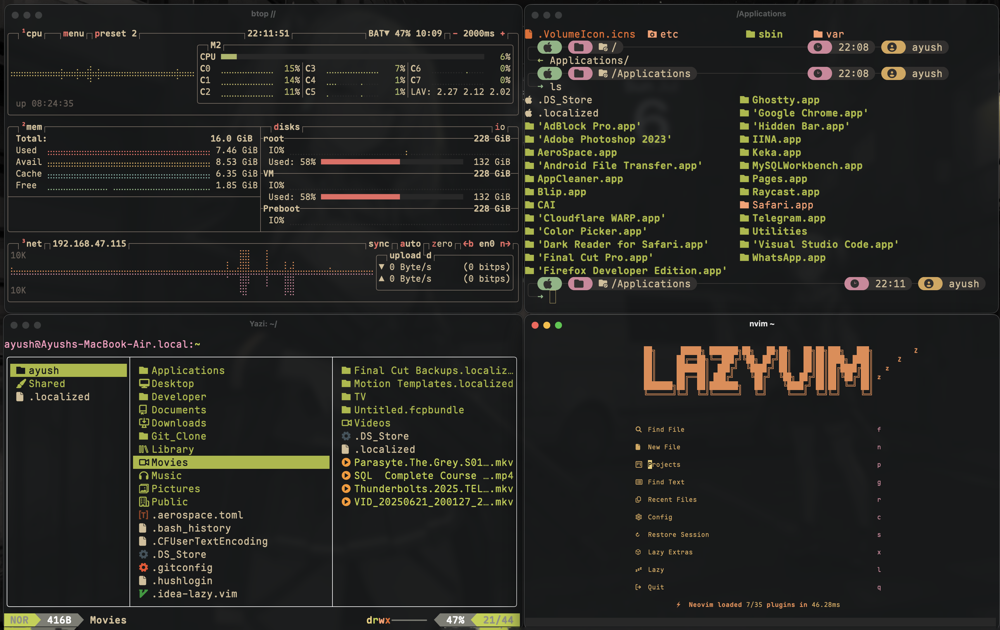

# DotAssets
Here are all of my dotfiles that I have customized for a consistent workflow on MacOS, using the GruvBox Material Theme for a cohesive look.

## My Configuration Files (MacOS)
A collection of configuration files for various tools and utilities, tailored for productivity and aesthetics.

## Fastfetch (Neofetch Alternative)
A modern system information tool, configured to display essential hardware and OS details with GruvBox colors.

## Btop 
A resource monitor for your terminal, set up to show CPU, memory, and process stats with a clean GruvBox-inspired interface.

## Neovim (LazyVim)
My Neovim setup uses LazyVim for plugin management, featuring GruvBox Material theme and custom keybindings for efficient coding.

## Starship Configuration for Fish Shell
A minimal, fast, and highly customizable prompt for Fish Shell, themed with GruvBox colors and useful segments for git, node, and more.

## Yazi
A fast terminal file manager, configured for smooth navigation and GruvBox aesthetics.

## Combined Showcase
A snapshot showing all configurations working together for a unified and visually pleasing terminal experience.

